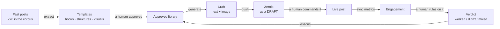

# Pixii Intelligence

Pixii Intelligence is a human-in-the-loop system for learning from LinkedIn content and writing
the next post. It reads existing posts, extracts reusable patterns, generates new drafts from
those patterns, and remembers both their engagement and a human's verdict. That feedback becomes
context for the next generation.

A post is modeled as three separate components:

- **Hook** — how the post opens.
- **Structure** — how the argument or story unfolds.
- **Visual** — the layout or image that accompanies it.

Every generated draft records the exact versions of all three templates that created it. That
lineage lets later engagement and human feedback reach the correct templates rather than whatever
their newest versions happen to be.

Two boundaries are fundamental:

- **It never publishes on its own.** Nothing automated — not the daily run, not the
  scheduler — can put a post in front of an audience. A person schedules or publishes it,
  deliberately, against the exact version of the words they read. That used to mean opening
  Zernio; now it can happen here, behind a switch that is off by default. The guarantee is
  the same one; see [ADR 0002](docs/adr/0002-human-publication-authority.md).
- **It does not rank templates as "best."** There is not enough lineage-attributed performance
  data yet to make that statistically reliable.

The proposed next-generation architecture—including team authentication, durable daily automation,
Teams notifications, publishing and scheduling from Pixii, compliant reference capture, deep
research, and multi-provider image generation—is documented in the
[Pixii Platform Blueprint](docs/architecture/2026-08-04-pixii-platform-blueprint.md). Its external
API assumptions are backed by the companion
[official platform research](docs/research/2026-08-04-platform-api-research.md).

---

## What it can do

- Import published posts and metrics from Zernio.
- Add external or reference LinkedIn posts manually.
- Extract proposed hook, structure, and visual templates from the corpus.
- Let a human approve, edit, version, retire, or author templates.
- Generate a complete LinkedIn draft from an idea or topic, through a brief, a claim plan,
  research, deterministic gates and an editorial-readiness rubric, and report each of those
  stages while it is happening.
- Choose how much research a draft buys — or let the application detect the floor, which it
  will refuse to go below.
- Check every factual assertion the finished post makes against the sources actually read, and
  refuse the ones nothing backs.
- Suggest templates while allowing every choice to be overridden.
- Group the hook list by what extraction recorded a chosen structure pairing with — a grouping
  and never a filter, so every approved hook stays selectable.
- Create several variants of one idea, then keep the preferred draft.
- Regenerate text and visuals independently without changing their lineage.
- Render deterministic HTML visuals or use AI-generated imagery.
- Upload and reuse logos, screenshots, product images, and other brand assets.
- Push a chosen result to Zernio as a draft, idempotently.
- Schedule it, publish it now, or cancel a schedule — from here, once publishing is enabled.
- Detect when that draft has subsequently been published by a human.
- Synchronize metrics and preserve engagement snapshots over time.
- Record a verdict — **Worked**, **Didn't**, or **Mixed** — and its reasoning.
- Feed those human-written lessons into future generation.
- Produce capped autonomous draft batches without pushing them anywhere.
- Run that batch once per local day, claimed durably, and report it as a Teams card.
- Show every point where the workflow is waiting on a human in one Inbox.
- Run each of those pulls and batches from a screen rather than from `curl`, behind a
  confirmation that names what it costs and what it reaches.
- Browse every research run and read the dossier behind any of them.

## How to use it

If the app is already running, open [http://localhost:3000](http://localhost:3000). The Inbox is
the home screen and the daily starting point: it draws the full circuit, puts the oldest human
blockers first, and points to the largest queue.

The normal workflow is:

1. Start at **Inbox** and open the oldest waiting item.
2. Review proposals in **Templates**. Approve at least one hook, structure, and visual; retire
   patterns you do not want to reuse. Retiring preserves the historical record.
3. Open **Studio**, enter an idea, and choose templates or ask the application to suggest them.
   Choosing a structure groups the hook list under what extraction recorded that structure
   pairing with; it narrows nothing away, because the pairing names *families* and resolves to
   whichever of their versions are still approved — against the library today each approved
   structure resolves to one hook out of six, so hiding the rest would leave you with one
   option. Grouped, not ranked: it is a record of what the corpus showed, not a claim that one
   hook does better.
4. Generate a draft. Studio answers immediately with a draft id and then reports each stage as
   it happens — planning, researching, drafting, verifying, evaluating, rendering — because the
   run itself happens in the background and commits every stage as it enters it. The run
   creates an editorial brief and angle/claim plan, settles the research depth — **Auto**, which
   is the detected floor, or a depth you raised above it in the control beside the idea —
   completes any required research, writes from that dossier, runs deterministic gates and the
   editorial-readiness rubric, and only then renders the visual. Leaving the page or reloading
   it does not lose the attempt: the address carries the draft id and the stages are already
   in the database. Pressing Generate twice buys one run, not two.
5. Inspect the brief, angle, research-floor reason, planned claims, sources, gate findings,
   readiness decision, prompt versions, image, and exact template versions under **Lineage**.
   The Editorial workflow block holds the rest: the constraints, the beats, the depth three ways
   with the signals that produced the floor, every claim the finished post asserts and what
   stands behind it, every rubric deduction with its evidence, the revision rounds spent, and
   every prompt that ran — including research and revision, which write no row of their own.
   A failed workflow remains visible with its reason and can be retried as a new auditable attempt.
   Five kinds of draft read differently there and are not conflated: one with the complete
   lineage, one written by the deprecated unreviewed path, one still planning, one whose run
   stopped before the brief was written, and one that genuinely predates the migration. The
   unreviewed one cannot be pushed and its button says so rather than waiting to be refused.
6. Regenerate individual parts or create variants if the first result is not right. Rewritten
   editorial drafts return to `failed_review` until the complete review flow is retried.
7. Push the chosen result to Zernio. Pixii sends a draft. Failed and failed-review candidates
   are refused at this boundary.
8. Schedule or publish it. Studio shows a publication panel for any draft that has reached
   Zernio. Nothing fires from the button that names it: Schedule, Publish now and Cancel
   schedule each open a confirmation showing the action, the destination account, the local
   time as typed, the timezone, and the UTC instant those two resolve to, alongside every
   command already issued against the draft. A command is refused if it was confirmed against
   an older version of the words. With `PUBLISHING_ENABLED` off — still the default — the
   panel says so up front and the three buttons are disabled, rather than letting you compose
   a command and then refusing it; publishing happens in Zernio by hand.
9. Synchronize metrics after the post has accumulated meaningful engagement.
10. Record a verdict and explain why it worked, did not work, or produced a mixed result.
11. Return to **Inbox** and confirm the item moved to the next gate or completed the circuit.

### Studio generation flow and failure behavior

The directed Studio endpoint is `POST /drafts/workflow`:

```text
idea → editorial brief → angle + planned claims → research-depth floor
     → optional Firecrawl/Brave search + fetched/cited dossier → source-disciplined write
     → deterministic gates → bounded revision → claim verification against the dossier
     → editorial-readiness evaluation → persisted review state → visual render
     → human review → optional Zernio draft
```

- `none` still builds the brief and plan, but makes no web request. `light` and `deep` must
  finish research before writing. An explicit mode below the detected floor is refused — with
  what was asked, what the floor is and which signals produced it, before a draft row exists.
  The depth may always be raised and never lowered, and it is never silently changed in either
  direction. Studio, Write variants and Re-topic all send the same field.
- `FIRECRAWL_API_KEY` enables factual research and is preferred when configured;
  `BRAVE_SEARCH_API_KEY` is the fallback. Without either, `light`/`deep` stop at a visible failed
  research state; they never fall back to `none`.
- Model JSON is checked against the registered output schema. Missing or mistyped write fields
  produce a persisted, recoverable drafting failure.
- Unsupported and contradicted dossier claims are blocking evidence findings and are never sent
  to the wording revision loop. Correctable writing findings use at most two revision rounds and
  three revision calls, including the single schema-repair attempt already defined by that loop.
- Every assertion the **finished post** makes is then checked, which is a different question
  from the one the plan answers. Comparing the plan against the dossier can only ever see
  claims somebody planned, so a statistic the model invented while writing had never been
  looked at by anything. `backend/app/verification.py` reads the written candidate instead: a
  registered, versioned prompt decides which sentences are checkable factual assertions and
  names the evidence for each, and this side decides whether that evidence exists. A dossier
  claim is named by its run-local `C1`/`C2` label and resolved against the claims of that job,
  each of which was written only after its quoted span was found in a page the job actually
  fetched. The idea is cited by quoting it character for character. Nothing else counts, so an
  assertion nothing supports — or one the sources refute or disagree about — is a blocking
  evidence finding. `none` mode is not an exemption and is not a separate branch: it is the
  same path with the idea as the entire evidence set, which is what makes "makes no external
  factual claim" a checked property rather than an intention. Opinions and statements about our
  own work need no citation. Voice exemplars are never evidence: verification is never shown
  them. What was checked, and what stood behind it, is persisted on the draft — `null` means
  nobody verified it and an empty assertion list means somebody did and found nothing to check.
- A gate or readiness failure is stored as `failed_review`, with findings/feedback. A visual
  failure stores `visual_error` while preserving the reviewed words.
- A run whose process dies stops reading as one still going: a draft left in a non-terminal
  stage for longer than `WORKFLOW_TIMEOUT` is recorded as failed, with what is actually known
  about it, and can be retried as a new attempt.
- Drafts store nullable links to the brief, angle plan and research job, plus correlation ID,
  write prompt version, exact template versions, gate findings, readiness report and revision
  count. Drafts created before this migration return `editorial: null` and continue to open.
- Generation never publishes or pushes. Autonomous generation remains unable to push. Zernio
  push still creates a draft, and the publishing kill switch plus revision confirmation remain
  unchanged.

The verdict explanation is especially important: the note, not just the label, is the lesson
supplied to later generations.

If something looks empty, read the wording before treating it as a failure. `0`, `—`, and an empty
queue mean different things throughout the product. If the API itself is unavailable, the route
says so instead of pretending the list is empty.

### Every path that writes a draft, and whether anything reviewed it

There are five, and they stopped being equivalent. Four run the same reviewed workflow; the
fifth writes words and declines to vouch for them.

| Path | Reviewed | Notes |
|---|---|---|
| `POST /drafts/workflow` | Yes | Studio's Generate. Asynchronous: answers at `planning` and commits each stage as it enters it. |
| `POST /drafts/variants` | Yes | One complete workflow per template combination, capped by `variants_max`. |
| `POST /drafts/retopic` | Yes | Inherits the source draft's exact `(family_id, version)` for all three templates, and draws the visual with the renderer that row declares. |
| `POST /drafts/autonomous-run`, and the daily slot | Yes | Capped by `autonomous_max_drafts`, and cannot push, schedule or publish. It takes a search adapter, so a factual topic researches or stops at a visible failed research state — with no key configured that is failures rather than opinion pieces written as though they had been checked. |
| `POST /drafts` | **No** | Deprecated. One completion: no brief, no angle, no research, no gates, no rubric. |

`POST /drafts` is worth saying out loud rather than leaving in a docstring, because an
undocumented bypass is exactly what it would otherwise be. It is still reachable, because
existing API clients call it, and it is marked `deprecated=True` so `/docs` says so. It sets no
stage, so its drafts take the column's default of `unreviewed`, and every boundary downstream
reads the same predicate: the push route refuses them, the schedule, publish and cancel routes
refuse them, and Studio disables the Push button and says why instead of offering a press the
server would answer 409 to. Nothing enforces this specially; it falls out of the route not
claiming a review it did not do.

### What a run looks like from outside, and what a retry does

A draft's `generation_stage` is one of `unreviewed`, `planning`, `researching`, `drafting`,
`verifying`, `revising`, `evaluating`, `rendering`, `ready`, `failed` or `failed_review`
(`backend/app/models/stage.py`, which is also where "may a human act on this" lives, as one
predicate rather than three hand-written copies of one set).

Generation returns immediately and Studio polls the draft, naming what each stage is doing
rather than repeating the stage's own word. The run happens on its own connection and commits
each stage as it enters it, which is what makes the stage readable at all — and what makes a
reload recover the attempt, since the draft id is in the address bar and the row is already in
the database. Pressing Generate twice buys one run: the claim is a unique index derived from the
request, and the second press is answered with the run already going.

A run that outlives `WORKFLOW_TIMEOUT` in a non-terminal stage is recorded as failed with what
is actually known about it, so a process that died stops reading as one still working. Retry
starts a **new** draft and a new auditable attempt; the failed one stays where it is, with its
stage and its reason, rather than being overwritten by the attempt that replaced it. The new
attempt runs against the failed draft's own recorded template versions, not the newest version
of each family — a retry reproduces the attempt that failed, and resolving forward would quietly
retry something else.

### What schedule, publish and cancel are allowed to send

Schedule and publish send the words the reviewer confirmed. Zernio used to receive the time and
the media and never the text, so a draft pushed, rewritten locally and then scheduled left the
confirmation screen showing the new words while Zernio kept the old ones. Two refusals close the
rest of it: a draft that is not review-ready cannot be commanded at all, and a draft whose
revision has drifted from the one Zernio is holding is refused with both numbers rather than
publishing something nobody read. Cancel is exempt from both on purpose — the state those guards
exist for is a scheduled post whose words have since failed review, and cancel is the remedy for
it. Cancel withdraws the appointment and is the one command that never carries `content`, so it
cannot rewrite the remote post on its way past.

---

## The idea in one picture



That circle is **the circuit**. One full trip round it is **one lap**. The Inbox shows a counter
for how many laps have completed.

It currently reads **0**. Everything in the loop works and has been tested; nobody has published
a generated post yet, so the loop has never closed. That is a people problem, not a code problem.

---

## The three ideas behind it

**1. A post is a hook, a structure, and a visual.** Not one blob of text. If you separate those,
you can keep the shape that worked and change the subject. "The equation hook" or "the
offer-reward structure" become things you can reuse deliberately instead of by feel.

**2. Every draft remembers exactly what made it.** Not "hook v-latest" — *hook `stat-hero` v1,
which is now retired*. That is the whole point: when a post does well, you need to know which
version of which template produced it, or the record is worthless. Several bugs in this project
were of exactly this kind — code that resolved "the newest version" instead of "the version this
draft actually used" — and each one silently credited the wrong template.

**3. A human judges, the machine remembers.** The tool never decides a post was good. It asks
you, records your answer and your reason, and feeds your words back into the next prompt.

---

## The eight screens

| Screen | What it's for |
|---|---|
| **Inbox** (`/`) | Home. Four queues of things waiting on a human, how long each has waited, and the lap counter. If you only open one page, this is it. |
| **Studio** (`/studio`) | Write. Type an idea, pick templates or let it suggest them, generate a draft with its image. Also opens any existing draft. |
| **Corpus** (`/posts`) | Every post the tool knows about, filterable, with an engagement chart. This is the raw material. |
| **Post detail** (`/posts/[id]`) | One post: its engagement over time, the templates that produced it, and the form where you rule on it. |
| **Templates** (`/templates`) | The library. Approve or retire proposals, author new templates, edit existing ones. **This is the main bottleneck** — 50 proposals are waiting. |
| **Assets** (`/assets`) | Images that templates can use. Upload, tag, delete. |
| **Scoreboard** (`/scoreboard`) | What each template version has actually done. Mostly empty, honestly so. |
| **Operations** (`/operations`) | The work that isn't writing: pull the corpus from Zernio, pull engagement back, import a LinkedIn scrape, run a capped unattended batch, and browse every research run. Each operation says what it needs configured, what it will spend and what it will do, before it does it. None of them publishes, schedules or pushes. It also reports back: every daily editorial run the scheduler recorded, newest first, with what it produced and why it stopped if it did. |

### The four Inbox queues

These are the four points where the circuit stops and waits for a person:

1. **Proposals awaiting review** — extraction suggested a template; only you can approve it.
2. **Built, awaiting push** — a draft exists locally and hasn't been sent to Zernio.
3. **Pushed, awaiting a human** — it's sitting in Zernio as a draft, waiting on a person to
   schedule or publish it. A draft already scheduled is *not* here: it is waiting on a clock,
   and a queue that promises "these are waiting on you" must not hold things you cannot act
   on.
4. **Published, awaiting verdict** — it went live; nobody has ruled on it yet.

---

## What it deliberately refuses to do

This is the part that surprises people, and it is a decision, not an omission.

This section used to lead with a number: engagement spans **12.7×**, the median post gets 525
engaged actions and the best gets 6,691. That was measured over a 107-post corpus that had come
almost entirely from Zernio. The corpus is 276 posts now — 219 of them added by hand as external
reference material, whose engagement was captured a different way and 218 of which carry no
impressions reading at all — so the old figure is not out of date, it is **unrecomputable**.
Over the 213 posts carrying any engagement, the median is 14 and the best is 4,331. That ratio
is 309×, and quoting it as the old number recomputed would be averaging two populations and
presenting the result as one distribution, which is the exact move this section exists to
refuse. What can honestly be said is the direction: the corpus is now a mixture of measured and
scraped rows, which puts the sample a ranking would need **further away, not closer**.

The sample size is the part that does not depend on any of that. Of the 61 templates in the
library, 40 cite **one** source post and 4 cite two, and not one template version has a single
lineage-attributed published post behind it. At that sample size, any ranking you compute is
noise wearing a confident face.

The remaining 17 templates cite nothing, which is worth stating separately because it is a
different problem: **every structure template in the library has an empty provenance list**,
along with two proposed visuals. Extraction keeps only the ids the model was actually shown, so
an empty list means the citations did not survive that check rather than that nobody asked for
them. A hook you can trace back to the post it came from and a structure you cannot are not the
same evidence, and ranking would treat them as if they were.

So the tool:

- **Never says "best", "top", or "recommended."** There is no sort-by-performance control
  anywhere, and adding one would be undoing a decision rather than adding a feature.
- **Always shows its sample count**, and flags anything under 5 as `too thin (n/5)`. Every row
  on the Scoreboard currently reads 0.
- **Prints `—`, not `0`, where data was never collected.** 239 of the 276 posts in the corpus
  carry no impressions figure — they were scraped, not measured. Showing `0` would present an
  absence as a measurement. For 185 of them the absence is arithmetic — a post with engaged
  actions did not have zero impressions. For the remaining 54 both columns read zero and the
  database genuinely cannot tell an unread analytics window from a post nobody saw; the Corpus
  table dashes those too and says underneath which two things it is refusing to choose between.
- **Shows `Closed circuits: 0`** rather than hiding the counter until it's flattering.

The optimizer — actual ranking — is not a backlog item. It is a **threshold**: roughly 300 posts
with recorded template lineage. There are currently zero.

**Nothing here ever publishes on its own.** Automation prepares and then stops: the daily slot,
the metrics scheduler and `run_autonomous` have no path to a publish command and must not learn
one. A post reaches an audience only when a person hits the route that sends it, only while
`PUBLISHING_ENABLED` is on — it is off by default — and only against the exact draft revision
that person confirmed; a command carrying any other revision is refused rather than sent. That
is narrower than the rule it replaces, which said the publish step could happen only in Zernio,
and it keeps what that rule was protecting: no machine decision reaches an audience unless a
person said so. It rests on Pixii running on localhost for one operator.
[ADR 0002](docs/adr/0002-human-publication-authority.md) is the authority, and it names the
condition that voids the arrangement — a second person, or anything but localhost — at which
point authentication and a publisher role are required before the switch may be on again.

---

## Running it

Prerequisites: Docker, Python 3.12 with `uv`, Node.js, and `pnpm`.

For a fresh checkout, install both applications' dependencies:

```bash
make install
```

Configure the variables documented in `.env.example`. Locally, `.env` is a **symlink** to the
vault's `.env`; never copy secret values into this repository. `GET /health` reports whether each
external integration is configured without exposing its credential.

Run the three components in separate terminals:

```bash
# Terminal 1 — Postgres on :5433
make up

# Terminal 2 — migrations and FastAPI on :8000
make api

# Terminal 3 — Next.js on :3000
make web
```

Then open:

- Application: [http://localhost:3000](http://localhost:3000)
- Interactive API documentation: [http://localhost:8000/docs](http://localhost:8000/docs)

Check the running services:

```bash
curl -s http://localhost:8000/health
curl -s http://localhost:8000/inbox
```

Stack: Python 3.12 · FastAPI · SQLModel · Alembic · Postgres · Next.js 16 · React 19 ·
TypeScript · Tailwind 4 · Radix · Recharts. Tests: pytest + Vitest/Testing Library.

---

## Testing it

### 1. Automated checks

Run the complete quality gate:

```bash
make check
```

`check` is `lint test build`, so that one command runs Ruff, mypy, ESLint, `tsc --noEmit`,
pytest, Vitest **and the Next.js production build**. To run one side only:

```bash
cd backend && .venv/bin/pytest -q
cd ../frontend && pnpm test
```

**What `make check` does not touch**, and what therefore has to be run separately before a
change is called done:

```bash
cd backend && .venv/bin/alembic heads          # exactly one, or two agents wrote migrations
cd backend && .venv/bin/alembic upgrade head   # the migration actually applies
cd backend && .venv/bin/alembic check          # the models and the migrations agree
cd /path/to/repo && git diff --check           # no whitespace damage in the diff
```

Alembic is outside the gate even though the suite runs against a real Postgres: the tests build
their schema from `SQLModel.metadata.create_all` rather than by running the migrations, so a
migration that is missing, duplicated or disagrees with the models is invisible to every test in
the file. `git diff --check` is outside it because it is a property of the diff rather than of
the code. Two agents writing migrations in the same wave is how this repo gets two heads, which
is why `alembic heads` is on the list and not merely available.

A green gate is necessary and it is not evidence. It says nothing about layout, focus,
contrast, chart sizing or any integration that is mocked in the suite and real in production —
which is what the visual and end-to-end checks below are for, and why the standard for a new
test is to break the behaviour on purpose and confirm the test fails.

### 2. Safe UI smoke test

This pass stays local except for generation or rendering calls and does not push to Zernio:

1. Visit every screen and confirm an API failure is distinguishable from an honestly empty list.
2. Approve one hook, one structure, and one visual template. Start with a text-only visual such as
   `stat-card`; an `image_url` slot needs an asset selected. Then, in Studio, choose that
   structure and open the hook list: it should be grouped under a heading naming the structure,
   with every other approved hook still in the list under its own heading, and the line beneath
   the selects should say which of the four states it is in — reading, unreadable, nothing
   recorded, or grouped.
3. Generate an opinion-only draft. Studio should answer at once with a draft id in the address
   bar and then name each stage as the run enters it, and finish showing `none`, a floor reason,
   a brief, an angle, planned claims, what the finished post asserts, passed gates, a readiness
   result, text, visual and template versions.
4. Reload the page mid-run and confirm the attempt comes back rather than being lost, and that
   pressing Generate twice buys one run rather than two.
5. Generate a factual draft with Firecrawl configured. Confirm `light` or `deep` is shown,
   sources are linked, citations support the factual wording, and the research job persists and
   appears under Operations.
6. Ask for `none` on that same factual idea and confirm the request is refused before a draft
   row exists, naming what was asked, the floor and the signals that produced it. Then raise the
   depth to `deep` and confirm a request above the floor is accepted.
7. Temporarily unset both search keys, retry a factual idea, and confirm it stops in a visible
   failed research state without writing factual copy and without falling back to `none`.
   Restore the key and use Retry, then confirm the failed attempt is still there beside the new
   one.
8. Regenerate the text and verify its lineage does not change and it is visibly marked for
   review again. Redraw the visual and verify a render failure leaves the written post intact.
9. Open a draft created before the migration and confirm it loads with a historical-lineage
   note, distinct from an unreviewed draft, a run still planning, and a run that stopped before
   its brief was written.
10. Confirm an unreviewed or failed-review draft cannot be pushed and its button says so; confirm
    a ready draft pushes to Zernio only as a draft. Leave `PUBLISHING_ENABLED=false` throughout,
    and confirm the publication panel states that up front with its three buttons disabled.
11. Regenerate the visual, compare it with the previous version, and restore the previous image.
12. Generate three variants, keep one, and confirm the discarded drafts leave the Inbox. Each
    variant is a full reviewed run, so expect some to arrive as `failed_review` rather than as
    three finished posts.
13. Upload an asset and try a visual with an image slot.
14. Exercise Corpus filters, open a post detail page, and inspect the unranked Scoreboard.

Generation and AI rendering may make paid external API calls even though this test does not push
a draft anywhere.

### 3. Browser and responsive test

Automated DOM tests cannot reliably prove layout, focus, chart sizing, or contrast. Inspect every
screen in a real browser at **390px** and **1440px**, in both light and dark modes. Check that:

- The page itself has no horizontal overflow.
- Navigation, buttons, dialogs, and keyboard focus remain usable.
- Charts have visible dimensions.
- `0`, `—`, an empty queue, and an unavailable API are presented as different states.

### 4. Full Zernio circuit

This walks one post all the way round the loop. **Steps 1–4 are yours. Step 5 is Monte's, and it
is the only step no software can do for you.**

### Before you start

```bash
curl -s http://localhost:8000/health   # required integration credentials should read true
curl -s http://localhost:8000/inbox    # four queues plus closed_circuits
```

Only continue when you intend to create a real external draft. Verify the Zernio, Azure chat, and
renderer configuration you plan to use. The push and metrics steps require Zernio credentials;
generation requires Azure chat; AI visuals require Azure image credentials.

### 1 · Approve at least one of each template kind

Open `/templates`. You need **one approved hook, one approved structure, and one approved
visual** — generation cannot run otherwise, and Studio will tell you so.

50 proposals are waiting. Read a few, approve the ones that look right, retire the rest.
Editing a template writes a **new version** rather than overwriting, so past posts keep pointing
at the wording that actually earned their numbers.

> Prefer a visual whose slots are all text. A visual with `image_url` slots needs an asset
> picked, or it renders with empty boxes. `stat-card` is the safe one.

### 2 · Generate a draft

Open `/studio`. Type an idea. Either pick a hook/structure/visual or press **Suggest templates**
and let it choose. Press **Generate draft**.

You should get post text and a rendered image, with a **Lineage** block naming the exact template
versions used. Check that block — it is the record everything downstream depends on.

Try **Write variants** too: same idea, three different template combinations, side by side. Keep
one and the others are deleted.

### 3 · Push it to Zernio

Press **Push to Zernio as draft**. The button disables itself afterwards and the draft shows its
Zernio id.

Verify it landed as a **draft**, not a live post — open Zernio and look. This is the safety
property the whole tool is built around, so check it with your own eyes at least once.

Call push a second time and confirm it returns the same draft without creating a duplicate. The
route and underlying request are idempotent, but this live check proves the external behavior.

### 4 · Confirm the Inbox moved

Reload `/`. The draft should have moved from **Built, awaiting push** to **Pushed, awaiting
Monte**. Both queues link straight to the draft in Studio.

### 5 · Monte publishes it — the step that actually closes the loop

Ask Monte to publish that specific draft in Zernio.

> **Do not delete and repost it.** That mints a new Zernio id, and the tool joins the post back
> to the draft on the original id. Delete-and-repost breaks the lineage permanently.

### 6 · Pull the metrics back

Wait for real engagement — a day at least, ideally a few.

Open `/operations` and press **Sync metrics**. It confirms first — readings accumulate rather
than overwrite, so a sync appends one row per post — and then reports what it read, how many
snapshots it wrote, and how many drafts it found had gone live. The equivalent still works
from a terminal if you prefer:

```bash
curl -X POST http://localhost:8000/metrics/sync
```

The tool notices the draft went live, joins it to the published post, and starts recording
engagement snapshots. The post should now appear in **Published, awaiting verdict**.

### 7 · Rule on it

Open the post from that queue. You'll see its engagement curve and the templates that made it.
Record **Worked / Didn't / Mixed** and — this matters — **write the reason**. A verdict with no
note teaches the generator nothing; the note *is* the lesson.

### 8 · Confirm the lap closed

Reload `/`. **`Closed circuits` should read 1.**

Then generate another draft and check the prompt now carries your lesson. That is the loop
feeding itself, which is the entire point of the tool.

---

## Current state

Read off the live database on 2026-08-05, not from memory.

```
closed_circuits:              0     ← never completed a lap
proposals awaiting review:   50     ← the bottleneck
built, awaiting push:         4
pushed, awaiting Monte:       2
published, awaiting verdict:  0

corpus:      276 posts (238 Monte, 15 creator inspiration, 13 pixii.creates, 10 Pixii_ai)
             57 ingested from Zernio · 219 added by hand as external reference material
templates:   10 approved · 50 proposed · 1 retired
drafts:      6, every one `ready` and every one `editorial: null`
research:    0 jobs
daily runs:  0
verdicts:    0
tests:       1196 backend · 472 frontend
```

The two zeros in the middle are the ones worth reading. **The reviewed workflow has never
completed a real run.** All six drafts in the database predate the migration that introduced it
— that is what `editorial: null` with a `ready` stage means — and `GET /research` returns an
empty list, so no dossier has ever been built here outside a test. Every claim above about
briefs, floors, gates, verification and readiness is a claim about code that is tested and has
never yet produced a row in this database.

Visual templates can now be **extracted** rather than hand-authored. `POST /templates/extract/visuals`
shows a vision model the images of the posts that performed and asks for the layout underneath
them, as HTML — not as a prompt. Every proposal is rendered once before it is offered, so nothing
reaches the review queue that cannot be drawn, and the route is slow for that reason.

The brand mark is **pinned, never generated**: a slot declaring `role: "logo"` gets the real asset's
id as its `default_asset_id`, and the renderer embeds the file's own bytes. Set `BRAND_LOGO_ASSET_ID`
to the id returned by `POST /assets` and no model ever draws the logo. Leaving it unset is fine —
the slot simply has no default and the picker asks.

Extraction still proposes; a human still approves. Nothing here ranks a visual template, for the
same reason nothing ranks a hook.

The scoreboard reads empty and that is **correct**, not broken: no generated post has ever gone
live, so there is nothing to attribute.

---

## Where the bodies are buried

Things that cost someone hours. Full detail in `.scratch/v3/progress.txt`.

- **Zernio's join key is `latePostId`, not `_id`.** They are different namespaces; `_id` matches
  0 of 45 published posts.
- **Zernio's `/v1/analytics` is a 50-row window, not your account.** It also truncates silently
  two ways: over-limit returns HTTP 200 with an empty list, and unpaged returns page 1 of 4 that
  looks complete. Always check `pagination.total`.
- **Zernio reports `shares: 0` on every LinkedIn row.** It does not measure reposts. A sync used
  to overwrite real counts with zero.
- **Every datetime column is `timestamp without time zone`.** A value written as aware reads back
  naive after a round-trip, and comparing the two **raises**. Normalise through `main._utc`.
- **Lineage resolves through `generated_from(family, version)`, never "latest."** Getting this
  wrong credits the wrong template version, silently.
- **Azure image generation rejects any dimension not divisible by 16**, so 1080×1350 is
  unrequestable — ask for 1088×1360 and scale down.

---

## What is not verified, and cannot be by any test here

Written plainly because the alternative is discovering it in production.

- **The circuit has never run end to end.** Every segment is tested in isolation and proven
  against the live Zernio and Cloudflare APIs. The joins between them have never carried a real
  post all the way round.
- **The reviewed workflow has never completed a real run.** `GET /research` returns an empty
  list and all six drafts in the database return `editorial: null`, so the brief, the angle, the
  research floor, the dossier, the gates, the claim verification and the readiness rubric have
  produced rows in tests and in no other place. The review panel that displays them has only
  ever been rendered against fixtures.
- **No schedule, publish or cancel command has ever been sent.** `PUBLISHING_ENABLED` has never
  been true outside a test, so the `scheduledFor` format and the response shape the
  reconciliation pass reads are both chosen from documentation rather than from an answer.
- **Nothing has been measured against real engagement.** Every number in the scoreboard logic is
  exercised with fixtures. No verdict has ever been recorded.
- **Radix keyboard behaviour** — dialogs opening, focus traps, Escape, typeahead. jsdom only
  approximates focus, so these were checked by hand in a browser, not by tests.
- **The hook list's group headings have never been seen.** `SelectContent` is a Radix portal
  that does not exist while the select is closed, and a Radix trigger cannot be opened in jsdom
  at all — so the headings are asserted where they are decided (`hookGroups`) and the sentence
  beside the control is what a test can read on the page. Whether the heading aligns with the
  item text under it, and whether it is legible in dark mode, is unproven by any test here.
- **Chart rendering.** Recharts is 0×0 in jsdom; the charts were verified by looking at
  screenshots, not asserted.
- **Skeleton geometry.** Tests compare the declared container classes between a page and its
  loading twin; only a browser can prove the widths actually match.
- **Two UI surfaces have never been seen against real data** — the verdict-retract control and
  the asset picker's "use the template's default" — because no post carries a ruling and no
  template carries a default asset. Both were photographed against a read-only proxy instead.
- **`AddExternal`** (the "add a post from elsewhere" form on `/posts`) had no test file at all
  for two versions, which mattered because it writes to the corpus. It has three tests now.
  Three is a floor, not coverage.
- **Two of the three unattended passes still say nothing on any screen.** The daily editorial
  slot now reports itself: `/operations` lists every recorded run — the day it claimed, what it
  produced, and the error if it failed — so a run failing every morning for a week no longer
  looks like a quiet week. The metrics scheduler and the publication reconciliation pass are
  still log lines only, and they write no run row, so that list cannot report them and says so
  on screen. Closing the rest needs a row per pass, which is a schema decision. Full audit in
  [`docs/capability-matrix.md`](docs/capability-matrix.md), which lists every backend
  capability against the screen that reaches it — and the ones no screen reaches.
- **`/operations` had been serving nothing but its loading skeleton, and 460 green tests said
  otherwise.** It is a server component, and it imported `stamp` — the UTC timestamp
  formatter — from `studio/PublishPanel.tsx`, which is `"use client"`. That import does not
  fail; it succeeds and hands back a client *reference*, and calling it throws
  `Attempted to call stamp() from the server` while the page is rendering. Every panel below
  the fold was gone. **No test in this project could ever have caught it**, because jsdom
  renders server and client components identically and enforces no boundary between them — the
  suite was green the entire time. It was found by running `pnpm build`, starting the server,
  curling the page and reading the log, which is the fourth defect in this project's history
  that only rendering the page found. `stamp` now lives in `lib/stamp.ts`, which has no
  directive and can be called from either side.

---

## A note on the tests

Do not read a green `make check` as proof.

`make check` did not run the frontend suite at all until this version — every frontend test
written across two versions sat outside the gate. A later audit ran **204 deliberate mutations**
against the code to see which tests noticed; 190 did. Among the ones that didn't: six assertions
checking for a `404` that passed against routes **that did not exist**, because the framework
returns 404 for any unrouted path. Two routes had no HTTP coverage whatsoever.

Three of the worst defects this project has had — a page 10,384 pixels wide with its buttons
off-screen, every page's content misaligned with the nav, and a control invisible in dark mode —
were all found by **rendering the page and looking at it**, with a fully green suite the whole
time.

If you change something here, the standard is: **break it on purpose and check a test fails.**
