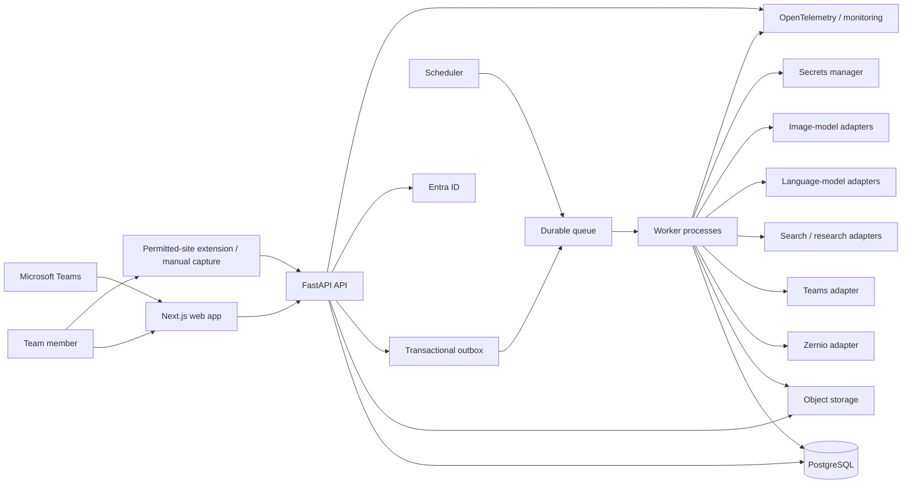
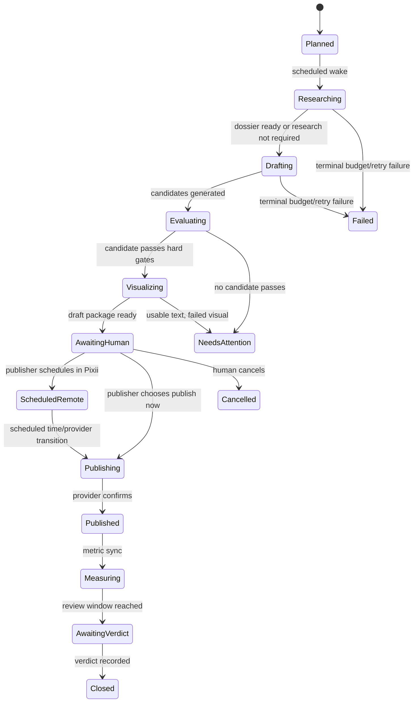
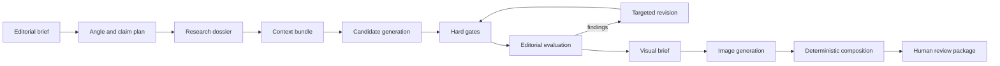

# Pixii Intelligence Platform Blueprint

**Status:** Proposed target architecture  
**Audience:** Engineers, product owners, security reviewers, and AI coding agents  
**Last reviewed:** 2026-08-04  
**Companion research:** `docs/research/2026-08-04-platform-api-research.md`

This document is the implementation contract for evolving Pixii Intelligence from a capable
single-user local application into a secure, automated, team-operated content intelligence
platform. It records the product rules, module seams, data model, workflows, external adapters,
security posture, test harness, delivery plan, and acceptance criteria needed to build the next
generation without rediscovering the architecture.

The goal is not to imitate the number of systems at a large technology company. The goal is to
apply the same engineering disciplines: explicit contracts, durable state, least privilege,
idempotency, observable workflows, staged delivery, reproducible tests, and reversible decisions.

---

## 1. Executive decision

Build a **modular monolith with separate API and worker processes**.

- Keep one transactional PostgreSQL database and one shared Python domain package.
- Run HTTP requests in a stateless FastAPI process.
- Run slow, retryable, and scheduled work in queue-backed worker processes.
- Store media and generated artifacts in object storage, not local application disk.
- Persist workflow state in PostgreSQL and publish jobs through a transactional outbox.
- Use typed provider seams for Zernio, Teams, search, language models, image models, and storage.
- Add Microsoft Entra ID authentication and role-based publishing authorization.
- Keep automation responsible for preparing work. Require an explicit human action in Pixii to
  schedule or publish through Zernio.
- Add compliant capture paths for owned or authorized content. A generic user-initiated Manifest
  V3 extension may support sites that permit capture, but it must block LinkedIn unless Pixii gains
  an official permitted data-access path and written legal/security approval.
- Replace the one-shot writing prompt with a research-grounded, evaluated generation pipeline.
- Produce final visuals through a hybrid pipeline: generative models create imagery, while a
  deterministic compositor places exact text, numbers, and the real Pixii logo.

Do **not** split this into microservices yet. The current scale does not justify distributed
transactions, duplicated schemas, network failure between domains, or per-module deployments.
The module seams below create a clean extraction path if load, ownership, or compliance later
requires a split.

---

## 2. Current state and the gap

### What is already strong

- Exact template lineage is preserved through `(family_id, version)`.
- Template edits are versioned instead of mutating historical evidence.
- Zernio draft creation is idempotent.
- Metric snapshots accumulate instead of overwriting history.
- Missing measurements are distinguished from measured zeroes in the user experience.
- Generation, renderers, and Zernio already have test-substitutable interfaces.
- Human verdict notes already flow back into generation.
- The system deliberately refuses statistically invalid template ranking.

These are product invariants to preserve through the restructure.

### Limits that block the requested product

- `backend/app/` is a flat package. Large files combine HTTP handling, orchestration, domain
  decisions, persistence, and provider calls.
- APScheduler runs inside the API process. A deploy or process crash can interrupt work, and
  multiple API replicas can register duplicate schedules.
- Slow generation and rendering happen synchronously inside HTTP requests.
- Media is stored under local `media/`; it is unavailable to another machine or replica.
- The Teams notifier sends plain webhook text and has no delivery record, deep-link model, or
  escalation path.
- The application has no login, organization membership, publisher role, or audit log.
- Publishing is limited to creating a Zernio draft; schedule and publish actions are absent.
- The generation "brain" is mostly one writing prompt with a small exemplar and verdict context.
- Research, citations, claim verification, prompt versions, evaluations, and generation traces
  are not first-class data.
- The application has no supported capture path from a post being viewed in the browser.
- Provider choice is configuration, not a policy-driven capability router.

### Immediate data-governance issue

The public repository currently tracks raw corpus material under `.scratch/corpus-widening/`,
including post text and creator images. The normalized database and `media/` cache are not in Git,
but the tracked scratch material is public. Phase 0 must classify this material and either approve
its public redistribution or remove it from Git history. A normal delete commit is not sufficient
if the material must no longer be public.

---

## 3. Product goals and non-goals

### Goals

1. Produce one or more reviewable, research-grounded content candidates on a daily schedule.
2. Notify the team in Microsoft Teams with the exact workflow state and a deep link to review.
3. Let an authorized person edit, schedule, publish now, cancel, or retry without opening Zernio.
4. Capture owned or authorized reference material through official APIs, user-supplied files/text,
   or a generic extension on sites whose terms permit it.
5. Improve writing quality through planning, research, evidence, critique, revision, and measured
   human feedback.
6. Generate high-quality branded visuals using Gemini/Nano Banana and Azure-backed providers.
7. Support multiple teammates safely with authentication, roles, auditability, and shared data.
8. Make every external call observable, idempotent where applicable, budgeted, and testable.
9. Allow an AI coding agent to implement bounded slices from this document without inventing
   architecture or weakening product rules.

### Non-goals

- No autonomous public posting in the first production version.
- No prediction that a post will perform well.
- No ranking of hook, structure, or visual templates until the documented evidence threshold is
  met.
- No bulk or unattended scraping of LinkedIn.
- No LinkedIn DOM-reading/copying extension under the current platform rules.
- No microservice decomposition solely for appearance.
- No custom model training before a prompt-and-evaluation baseline proves the need.
- No provider-specific objects crossing a domain module's interface.

---

## 4. Product invariants

These rules are load-bearing. A feature that changes one requires an Architecture Decision Record
(ADR), migration plan, and explicit product approval.

1. **Lineage is immutable.** A generated artifact records the exact template, prompt, model,
   source, and research versions that produced it.
2. **Human publication authority.** Automation may prepare content and propose a schedule. Only a
   current, authenticated human command may create a remote schedule or publish immediately.
3. **Zernio is an adapter, not the operator UI.** Day-to-day review, scheduling, publication, and
   status inspection happen in Pixii.
4. **No duplicate external effects.** Every publication command and notification has a stable
   idempotency key and an auditable attempt record.
5. **Unknown is not zero.** Missing metrics remain nullable in the target schema and render as
   unavailable, never as measured zero.
6. **Quality is not performance prediction.** An editorial-readiness grade measures compliance
   with an explicit rubric; it never claims expected engagement and never ranks templates.
7. **External content is untrusted data.** Captured pages and research sources cannot issue model
   instructions, inject markup, or select tools.
8. **Generated text and logos are deterministic in the final artwork.** An image model may create
   a scene or background; it must not be trusted to reproduce final copy, numbers, or the logo.
9. **Every expensive run has a budget.** Token, search, render, image, retry, and wall-clock limits
   are enforced server-side and recorded.
10. **Every destructive or external action is attributable.** Audit records include actor,
    organization, target revision, before/after state, timestamp, request id, and result.

The requested ability to publish from Pixii deliberately revises the repository's existing
"never publish" rule. The safe replacement is "never publish without an explicit authorized
human command in Pixii." Do not change existing runtime behavior until Phase 2 implements the
authorization, confirmation, audit, and idempotency controls together.

---

## 5. Target system topology



### Reference Azure deployment

Use Azure because the project already has Azure model credits and Teams is the collaboration
surface:

- Azure Front Door or an equivalent managed ingress with TLS and WAF.
- Azure Container Apps for `web`, `api`, and horizontally scalable `worker` processes.
- Azure Container Apps Jobs or a single scheduler deployment for time-based enqueueing.
- Azure Database for PostgreSQL Flexible Server, with `pgvector` only when semantic retrieval is
  introduced.
- Azure Blob Storage for source media, assets, research snapshots, and generated artifacts.
- Azure Service Bus for at-least-once job delivery and dead-lettering.
- Microsoft Entra ID for login and organization membership.
- Azure Key Vault with managed identities; no long-lived provider secret in application files.
- Application Insights / Azure Monitor receiving OpenTelemetry traces, logs, and metrics.

Local development uses Docker Compose with PostgreSQL, an object-storage emulator, and a queue
emulator or local adapter. The same domain modules run in local and cloud environments.

---

## 6. Repository structure

Migrate incrementally toward this monorepo layout:

```text
pixii-intelligence/
├── apps/
│   ├── api/                         # FastAPI composition root and thin HTTP adapters
│   │   ├── src/pixii_api/
│   │   │   ├── main.py
│   │   │   ├── auth.py
│   │   │   └── routes/v1/
│   │   └── tests/
│   ├── worker/                      # queue consumers and scheduler entry points
│   │   ├── src/pixii_worker/
│   │   └── tests/
│   ├── web/                         # Next.js application
│   │   └── src/
│   └── extension/                   # permitted-site Manifest V3 extension; LinkedIn blocked
│       ├── src/background/
│       ├── src/content/
│       ├── src/popup/
│       └── tests/
├── packages/
│   ├── python/
│   │   └── pixii_core/
│   │       ├── src/pixii/
│   │       │   ├── corpus/
│   │       │   ├── knowledge/
│   │       │   ├── research/
│   │       │   ├── editorial/
│   │       │   ├── generation/
│   │       │   ├── evaluation/
│   │       │   ├── creative/
│   │       │   ├── distribution/
│   │       │   ├── feedback/
│   │       │   ├── automation/
│   │       │   ├── notifications/
│   │       │   └── platform/        # shared IDs, clock, errors; no business logic
│   │       └── tests/
│   ├── prompts/                     # versioned prompts, schemas, rubrics, release notes
│   └── typescript/
│       ├── api-client/              # generated from OpenAPI; never hand-copied types
│       ├── design-system/
│       └── extension-contracts/
├── contracts/
│   ├── openapi.yaml
│   ├── events/
│   └── fixtures/                    # sanitized external-provider contract fixtures
├── database/
│   ├── migrations/
│   └── seeds/
├── tests/
│   ├── contract/
│   ├── integration/
│   ├── e2e/
│   ├── extension/
│   ├── evals/
│   └── load/
├── infra/
│   ├── local/
│   └── azure/                       # Bicep or Terraform, one chosen tool
├── docs/
│   ├── architecture/
│   ├── adr/
│   ├── runbooks/
│   └── research/
├── scripts/                         # thin operator entry points, not business logic
├── Makefile
├── pyproject.toml                   # uv workspace
└── pnpm-workspace.yaml
```

### Internal module layout

Each Python domain module follows a predictable internal shape only where the files earn their
existence:

```text
generation/
├── interface.py       # the small interface callers and tests use
├── domain.py          # entities, value objects, invariants
├── application.py     # orchestration behind the interface
├── ports.py           # only true external seams
├── adapters/          # concrete provider adapters
└── errors.py
```

Do not create generic `utils`, `helpers`, `services`, or `common/models` dumping grounds. Put a
concept beside the module that owns its meaning. `platform/` is deliberately small: identifiers,
clock, correlation context, and base error envelopes only.

### Build harness

The root Makefile is the stable human and CI interface:

```text
make bootstrap          install pinned Python and Node dependencies
make dev                start local dependencies and all application processes
make format             apply safe formatters
make lint               lint and static type-check all workspaces
make test-unit          pure, fast tests
make test-integration   real Postgres/object-store/queue tests
make test-contract      provider adapter contract tests against fixtures
make test-e2e           Playwright web and extension journeys
make test-evals         deterministic prompt and quality regression suite
make check              all required pre-merge gates
make migrate            apply database migrations
make seed-demo          load non-sensitive demonstration data
make backup             database plus object manifest, outside Git
make restore FILE=...   explicit, guarded restore
```

The implementation behind these commands may change; their interface should remain stable.

---

## 7. Domain modules and their interfaces

A module is deep when callers learn a small interface while substantial behavior remains local.
HTTP routes, queue consumers, and tests cross the same interface. Provider objects and ORM rows do
not cross it.

| Module | Small external interface | Behavior hidden behind it |
|---|---|---|
| **Corpus** | `capture(envelope) -> CaptureResult` | normalization, deduplication, provenance, revisioning, media intake, source classification |
| **Knowledge** | `build_context(query) -> ContextBundle` | voice-safe retrieval, template lineage, verdict lessons, semantic/keyword search, freshness rules |
| **Research** | `build_dossier(request) -> ResearchDossier` | query planning, search, fetch, extraction, claim mapping, conflict detection, citation validation, caching |
| **Editorial** | `plan(brief) -> EditorialPlan` | audience, angle, claims, narrative, CTA, research policy, visual brief |
| **Generation** | `create(request) -> CandidateSet` | prompt assembly, provider routing, structured output, candidate diversity, lineage and spend traces |
| **Evaluation** | `evaluate(candidate_set, rubric) -> EvaluationReport` | hard gates, editorial rubric, evidence coverage, duplication checks, revision recommendations |
| **Creative** | `produce(visual_brief) -> VisualSet` | provider routing, image generation, deterministic composition, brand checks, derivatives |
| **Distribution** | `submit(command) -> PublicationReceipt` | schedule/publish payloads, idempotency, status reconciliation, retry classification, audit data |
| **Feedback** | `record(verdict) -> FeedbackReceipt` | human verdicts, metric context, lesson eligibility, retraction/history |
| **Automation** | `advance(command) -> WorkflowSnapshot` | durable state transitions, budgets, retries, timers, human gates, compensation |
| **Notifications** | `deliver(notification) -> DeliveryReceipt` | Teams cards, deep links, deduplication, retry, escalation, delivery status |

Representative value-level contracts:

```python
@dataclass(frozen=True)
class ResearchRequest:
    organization_id: UUID
    question: str
    depth: Literal["none", "light", "deep"]
    freshness_after: datetime | None
    max_sources: int
    budget: ResearchBudget

@dataclass(frozen=True)
class PublicationCommand:
    organization_id: UUID
    draft_id: UUID
    draft_revision: int
    action: Literal["save_remote_draft", "schedule", "publish_now", "cancel_schedule"]
    scheduled_at: datetime | None
    timezone: str | None
    actor_id: UUID
    idempotency_key: str

class Distribution(Protocol):
    def submit(self, command: PublicationCommand) -> PublicationReceipt: ...
```

An ORM session, HTTP client, Azure SDK type, Gemini response, or Zernio payload must never appear in
these interfaces. Concrete adapters translate at the seam.

### Seam rules

- External providers are true external dependencies. Give each a production adapter and a fake or
  contract-fixture adapter for tests.
- PostgreSQL is local-substitutable. Test modules against real ephemeral PostgreSQL rather than
  creating a repository interface for every table.
- The object store and queue each have a local and cloud adapter; their seams are real.
- Do not expose internal prompt stages or evaluator passes simply so a test can call them. Test the
  module through its public interface and inspect observable artifacts and traces.

---

## 8. Canonical data model

Use UUID primary keys for new aggregate roots, UTC `timestamptz` columns, explicit organization
ownership, and optimistic concurrency (`revision` integer) on human-edited records. Existing
integer ids and naive timestamps migrate gradually; do not rewrite them in one release.

### Identity and access

- `organization`
- `user`
- `membership(organization_id, user_id, role)`
- `connected_account(provider, external_account_id, encrypted_credential_ref, status)`
- Roles: `viewer`, `editor`, `publisher`, `admin`

### Corpus and knowledge

- `corpus_item`: stable identity, source, canonical URL, platform id, author, capture status
- `corpus_revision`: normalized text/media metadata at a point in time
- `metric_snapshot`: nullable measurements plus capture time and provider provenance
- `media_asset`: content hash, object URI, MIME type, dimensions, rights/source metadata
- `capture_job`: extension/manual/import request, deduplication key, status, errors
- `template_family` and immutable `template_version`
- `verdict` and optional append-only `verdict_revision`

### Research and evidence

- `research_job`: request, depth, budget, provider policy, status, spend
- `research_source`: URL, publisher, fetched_at, content hash, trust tier, object snapshot URI
- `claim`: normalized claim text, confidence, freshness, contradiction state
- `citation`: claim-to-source mapping with a short supporting span and source location
- `research_dossier`: immutable, versioned bundle referenced by generation

### Generation and creative

- `editorial_brief`: audience, objective, idea, channel, research policy, proposed schedule
- `generation_run`: inputs, model policy, prompt revisions, seed, spend, status, trace id
- `content_candidate`: immutable generated revision with template and research lineage
- `evaluation_run`: rubric revision, hard-gate results, editorial scores, findings
- `draft`: mutable human workspace pointing to a chosen candidate and revision
- `visual_artifact`: provider, source prompt/brief, model version, object URI, dimensions, safety data
- `composed_creative`: deterministic layout/template version plus exact input artifact ids

### Workflow and distribution

- `editorial_slot`: planned channel, local time, timezone, status
- `workflow_run`: current state, next wake time, budget, correlation id
- `workflow_event`: append-only transition history; not full event sourcing
- `publication`: draft revision, desired action, provider state, remote id, scheduled time
- `publication_attempt`: request id, response classification, provider payload hash, timestamps
- `notification_delivery`: kind, destination, deduplication key, result, deep link
- `outbox_message`: transactional event waiting for queue delivery
- `idempotency_record`: scope, key, request hash, stored result
- `audit_event`: actor, action, target, before/after hashes, IP/session context

### Storage policy

- PostgreSQL stores metadata and transactional state.
- Object storage stores media, screenshots, fetched source snapshots, prompt artifacts too large for
  rows, and generated images.
- Store immutable object keys by content hash. Keep user-facing filenames as metadata only.
- Serve media through short-lived signed URLs or authenticated application routes.
- Define retention separately for raw captured pages, generated artifacts, logs, and audit events.
- Never store provider credentials or browser-extension tokens in business tables.

---

## 9. Daily automated editorial workflow



### Daily sequence

1. The scheduler creates one `workflow_run` per configured editorial slot using a unique
   `(organization, channel, slot_time)` key.
2. Automation selects a topic from the editorial calendar, saved idea inbox, configured feeds, or
   a research-backed topic proposal. It must reject recent semantic duplicates.
3. The editorial module chooses `none`, `light`, or `deep` research based on the brief and the
   human's policy. Claims about current facts, numbers, named organizations, or recommendations
   require research.
4. The research worker builds an immutable dossier with claim-level citations and contradictions.
5. Generation produces up to the configured candidate cap. Every candidate records prompt,
   template, context, research, model, and spend lineage.
6. Evaluation applies hard gates and the editorial-readiness rubric. The system may choose a
   default review candidate by craft grade, but that is not a template or performance ranking.
7. Creative generates or composes visual options and validates dimensions, brand colors, logo,
   legibility, and unsafe output.
8. The workflow enters `awaiting_human` and writes a `DraftReady` outbox event in the same database
   transaction.
9. The Teams adapter sends one deduplicated card: title, proposed slot, readiness state, research
   depth, cost summary, failure warnings, and a signed deep link to Pixii.
10. In Pixii, an editor may revise and regenerate. A publisher may choose **Save to Zernio as
    draft**, **Schedule**, or **Publish now**.
11. Distribution validates that the submitted revision is still current, records an audit event,
    and enqueues the external effect. The UI reports `accepted`, then streams or polls final state.
12. Workers reconcile Zernio state and metrics until the post is published and ready for a verdict.

### Human gate design

- A Teams card must not silently publish. It deep-links to an authenticated review screen.
- The review screen shows the exact revision, account, action, timezone, and time before confirmation.
- Only `publisher` or `admin` roles may schedule, publish, cancel, or change connected accounts.
- Require step-up confirmation for `publish_now`; scheduling may use a single explicit confirmation.
- Reject a stale command when the draft revision changed after the review page loaded.
- A global kill switch disables all external publication commands without disabling generation.

---

## 10. Compliant reference capture and optional extension

Do not build a LinkedIn DOM-scraping or copying extension. LinkedIn explicitly prohibits browser
extensions that scrape or copy the service, and its API terms restrict storing scraped
"Non-Official Content." The official Posts API does not provide a general route for arbitrary feed
posts a user encounters. See [LinkedIn prohibited software and extensions](https://www.linkedin.com/help/linkedin/answer/a1341387/prohibited-software-and-extensions?lang=en),
the [LinkedIn User Agreement](https://www.linkedin.com/legal/user-agreement), and the
[LinkedIn API Terms of Use](https://www.linkedin.com/legal/l/api-terms-of-use).

This is a product constraint, not a selector-engineering problem. Do not fetch LinkedIn pages
server-side, read arbitrary feed DOM/text/images, automate screenshots, reuse LinkedIn cookies, or
attempt an anti-bot workaround.

### Supported capture paths

1. Import owned/authorized posts through Zernio's external/native post synchronization.
2. Apply for LinkedIn's restricted official access if owned-member or administered-organization
   retrieval becomes a qualified product requirement.
3. Let a user save a LinkedIn reference URL plus their own notes without Pixii fetching the page.
4. Accept pasted text, images, documents, or screenshots only after the contributor confirms they
   own the material, have permission, or have a license for the intended use. Record that basis.
5. Offer a generic Chrome/Edge Manifest V3 extension only on domains whose terms permit capture.
   Block `linkedin.com` and other disallowed domains through signed policy/configuration.

### Generic extension user experience on permitted sites

1. A user views content on a permitted site and clicks **Save to Pixii** in the extension or
   context menu.
2. The extension previews what it found: author, URL, text, visible metrics, and media thumbnails.
3. The user can correct the text, add a note/tags, choose `voice` or `inspiration`, and confirm.
4. The extension sends a `CaptureEnvelope` to `POST /v1/captures` and receives a job id.
5. Pixii normalizes, deduplicates, downloads permitted media server-side, and reports the final
   corpus link. A duplicate opens the existing item instead of creating another row.

### Generic extension architecture

- A content script performs best-effort extraction from the active tab after an explicit click.
- A background service worker owns authentication, request retry, and message routing.
- The popup owns confirmation and correction; DOM extraction does not write remotely by itself.
- Use `activeTab` where possible instead of broad permanent host access. Chrome documents that it
  grants temporary access only after a user gesture; see
  [`activeTab`](https://developer.chrome.com/docs/extensions/develop/concepts/activeTab).
- Authenticate through OAuth 2.0 Authorization Code + PKCE. Store only short-lived user tokens in
  extension storage; never ship Zernio, Azure, Gemini, or Teams credentials in the extension.
- Use a versioned JSON Schema shared through `packages/typescript/extension-contracts`.
- Prefer a permitted site's stable native identifier and canonical URL. Fall back to a
  normalized-content hash when no identifier is available.
- Treat site-specific selectors as adapters with fixture-based tests because page markup changes.
- Provide resilient fallbacks: selected text, paste URL, manual text, and user-approved screenshot.
- Keep executable JavaScript inside the signed package as Manifest V3 requires; do not load remote
  code. See [Chrome's Manifest V3 migration guidance](https://developer.chrome.com/docs/extensions/develop/migrate/what-is-mv3).
- Do not implement background crawling, automated scrolling, bulk extraction, session-cookie use,
  or bypasses for blocked domains. Review the terms of every enabled site before distribution.

### Capture envelope

```json
{
  "schema_version": 1,
  "source": "browser_extension",
  "platform": "permitted_site",
  "canonical_url": "https://example.com/authorized-content",
  "platform_post_id": "provider-native-id-if-available",
  "captured_at": "2026-08-04T10:30:00Z",
  "author": {"display_name": "...", "profile_url": "..."},
  "content": "...",
  "visible_metrics": {"likes": 0, "comments": null, "shares": null},
  "media": [{"url": "https://...", "kind": "image"}],
  "classification": "inspiration",
  "note": "why this is worth saving"
}
```

Metrics are nullable because an absent or hidden number is not zero.

---

## 11. The content-generation brain

Replace one-shot prompting with an explicit artifact pipeline:



### Stage contracts

1. **Editorial brief** — objective, audience, idea, channel, desired reader action, constraints,
   brand, research depth, proposed time.
2. **Angle and claim plan** — one defensible thesis, tension, audience stake, planned claims,
   narrative beats, CTA, and disallowed repetition.
3. **Research dossier** — claims, sources, citations, contradictions, freshness, unknowns.
4. **Context bundle** — voice exemplars only from approved voice accounts, relevant templates,
   recent-topic exclusions, brand rules, and eligible human lessons.
5. **Candidate set** — deliberately different executions with complete lineage and structured
   output, not three copies with superficial wording changes.
6. **Hard gates** — schema validity, unsupported facts, missing citations, forbidden claims,
   template compliance, length, duplicate similarity, unsafe content, and visual-slot completeness.
7. **Editorial evaluation** — a versioned rubric producing findings and an editorial-readiness
   grade. It cannot predict engagement.
8. **Targeted revision** — revise against named findings with a maximum iteration and spend cap.
9. **Visual brief** — subject, scene, composition, hierarchy, brand palette, required exact text,
   logo placement, exclusions, and target sizes.

### Editorial-readiness rubric

Version the rubric as data. A suggested 100-point craft rubric is:

- Hook clarity and tension: 15
- Specificity and information density: 15
- Evidence and claim support: 20
- Narrative structure and flow: 15
- Pixii voice fidelity: 15
- Originality versus recent corpus: 10
- Reader value and CTA coherence: 10

An **A** means at least 90 points and every hard gate passed. It means ready for editorial review,
not likely to outperform. The evaluator must return evidence for each deduction. A language model's
self-score alone is not a release gate; combine deterministic checks, retrieval comparisons, and a
separate evaluator pass.

### Prompt and model governance

- Prompts live in `packages/prompts` with semantic versions, owners, input/output JSON Schemas,
  changelogs, and evaluation baselines.
- A generation trace stores the prompt version, model deployment/version, parameters, input artifact
  ids, output hash, latency, token/image/search usage, retries, safety response, and correlation id.
- Model routing is policy-based: required capability, data classification, region, latency, quality,
  and remaining budget. Callers do not name a provider directly.
- Structured outputs are schema-validated. Repair may run once; repeated invalid output fails with an
  actionable reason.
- Cache only by complete normalized input and model/prompt revision. Never let a stale research
  result masquerade as fresh.
- Keep a per-organization and per-workflow budget with hard server-side ceilings.

### Evaluation harness

Maintain a sanitized, reviewed set of briefs and expected properties:

- Voice fidelity examples and anti-examples.
- Supported versus unsupported factual claims.
- Near-duplicate recent topics.
- Strong and weak hooks under each approved template.
- Prompt-injection content in captured pages.
- Missing/contradictory research sources.
- Visual briefs with exact-copy and logo requirements.

Run deterministic checks on every pull request. Run paid model evaluations when prompts, models, or
rubrics change, and on a budgeted nightly canary. Compare against the approved baseline and block a
release on hard-gate regressions, not on noisy aggregate preference alone.

---

## 12. Search and deep research

Research is a first-class module, not a tool call embedded in the writing prompt.

Keep provider choice behind the research interface. Current official options include OpenAI's
[Responses API web search](https://developers.openai.com/api/docs/guides/tools-web-search) and
[deep research](https://developers.openai.com/api/docs/guides/deep-research), Google's
[Grounding with Google Search](https://ai.google.dev/gemini-api/docs/google-search), and Azure
Foundry's [web search tool](https://learn.microsoft.com/en-ca/azure/ai-foundry/agents/how-to/tools/web-search?view=foundry).
Preserve provider-returned citation metadata and required attribution instead of flattening it into
uncited prose. Azure's documentation says Grounding with Bing can transfer data outside Azure
compliance/geographic boundaries and is not covered by the Microsoft Data Protection Addendum;
confidential briefs therefore require security/legal review before that adapter is enabled.

### Research modes

- `none`: personal opinion, supplied source, or creative-only post; no external factual claims.
- `light`: confirm a small number of current facts against 2–4 high-trust sources.
- `deep`: multi-query investigation, primary-source preference, contradiction analysis, and a
  claim-level dossier.

The system recommends a mode, but the user can increase it. It must automatically require at least
`light` when the brief depends on current events, prices, laws, statistics, product capabilities,
named-company facts, or external recommendations.

### Pipeline

1. Convert the brief into answerable research questions and freshness requirements.
2. Generate bounded search queries and source-type preferences.
3. Search through a provider adapter.
4. Fetch through a hardened server-side fetcher with DNS/IP validation, timeouts, size limits,
   MIME allowlists, robots/policy handling, and no private-network access.
5. Extract readable text while preserving URL, title, publisher, date, and source position.
6. Treat fetched content as quoted evidence, never instructions.
7. Normalize proposed claims and map each to supporting or contradicting sources.
8. Prefer first-party documents, filings, standards, product documentation, and original research.
9. Produce a dossier that explicitly lists unresolved facts and disagreements.
10. Require every externally verifiable factual claim in the final candidate to map to a claim id.

### Research interface output

```text
ResearchDossier
  question
  researched_at
  freshness_policy
  sources[]
    url, publisher, published_at, fetched_at, trust_tier, content_hash
  claims[]
    claim_text, status, supporting_citation_ids[], contradicting_citation_ids[]
  citations[]
    source_id, short_supporting_span, source_location
  unknowns[]
  contradictions[]
  spend
```

Store only short supporting spans needed for audit. Do not reproduce full copyrighted pages in
prompts or exports. Preserve source links and content hashes so a reviewer can verify what the
system saw.

---

## 13. A-grade visual production

Use a provider-neutral creative module with at least these adapters:

- Gemini image generation / editing (the currently supported Nano Banana family).
- Azure OpenAI image generation.
- Deterministic HTML-to-image rendering for exact brand layouts.
- Fake adapters for tests.

As of this document's verification date, Google's
[image-generation guide](https://ai.google.dev/gemini-api/docs/image-generation) recommends
`gemini-3.1-flash-image` (Nano Banana 2) as the general-purpose workhorse and
`gemini-3-pro-image` (Nano Banana Pro) for demanding professional assets. Use explicit model ids,
not marketing labels, and revalidate the catalog before rollout. Google documents SynthID on all
generated images and model-specific limits on references, output count, and editing.

Microsoft's current
[Azure image-generation guide](https://learn.microsoft.com/en-ca/azure/foundry/openai/how-to/dall-e?view=foundry)
lists `gpt-image-2` as the generally available production candidate; DALL-E 3 is retired and the
other GPT Image variants may require limited preview access. Begin the Azure evaluation with
`gpt-image-2`, subject to region and quota availability. Current constraints include edges that
are multiples of 16, a maximum 3:1 aspect ratio, a bounded pixel count, and base64 responses that
the worker must decode, scan, and place in object storage.

### Hybrid production pipeline

1. Derive a structured `VisualBrief` from the approved content candidate.
2. Decide whether the job is `deterministic_card`, `generative_scene`, `edit_existing`, or
   `hybrid_composite`.
3. Route imagery work to the best configured provider based on capability, region, cost, and
   current health.
4. Generate a bounded set of source variants, preserving raw originals in object storage.
5. Run safety, relevance, artifact, aspect-ratio, and brand-palette checks.
6. Use deterministic composition to place the final headline, numbers, CTA, and actual logo.
7. Export exact 1080×1350 LinkedIn PNG plus thumbnails and web previews.
8. Record model/provider version, visual brief revision, input asset ids, prompt, seed where
   supported, safety result, transformation chain, and spend.
9. Let the human compare variants and restore previous versions.

### Quality rules

- Never ask an image model to spell final copy or redraw the logo.
- Never stretch a generated image to 4:5. Crop or outpaint using a declared focal point.
- Enforce safe margins and mobile-preview legibility.
- Run perceptual-hash duplicate checks against recent Pixii visuals.
- Make provider fallback explicit in lineage; do not silently change providers.
- Keep source-image rights and attribution metadata with every asset.
- Use the content safety controls supplied by each provider and retain refusal categories, not
  sensitive raw moderation payloads.

---

## 14. Distribution through Zernio

The distribution module supports four explicit commands:

```text
save_remote_draft
schedule(scheduled_at, timezone)
publish_now
cancel_schedule
```

The current official contracts support this design:

- Create a remote draft with [`POST /v1/posts`](https://docs.zernio.com/posts/create-post) and no
  `scheduledFor` or `publishNow`.
- Schedule an existing draft with [`PUT /v1/posts/{postId}`](https://docs.zernio.com/posts/update-post)
  using `isDraft: false`, `scheduledFor`, and `timezone`. `scheduledFor` alone does not take an
  existing draft out of draft state.
- Publish an existing draft immediately with `isDraft: false` and `publishNow: true`.
- Reconcile through list/status operations and verified lifecycle webhooks.

Zernio's current documented base is `https://zernio.com/api/v1`; the existing application uses a
legacy GetLate base. Change this only behind adapter contract tests and a live test-account probe.

### Required behavior

- Validate organization, connected LinkedIn account, publisher role, current draft revision,
  complete lineage, media readiness, and action-specific fields before enqueueing.
- Write the publication intent, audit event, and outbox message in one transaction.
- Compute an idempotency key from organization, draft id, revision, destination, and action.
- Persist and reuse the same Zernio `x-request-id` for every retry of one logical command. Zernio
  documents an approximately five-minute request-id window plus a 24-hour content-fingerprint
  duplicate guard; Pixii's database guarantee must remain durable beyond both windows.
- Never retry a validation or provider refusal as though it were a network timeout.
- Retry transient failures with exponential backoff and jitter, bounded attempts, and a dead-letter
  state that appears in Inbox and Teams.
- Reconcile provider state after an ambiguous timeout before creating another remote post.
- Preserve Zernio's remote post id and join key separately when its API exposes multiple ids.
- Store requested local time, IANA timezone, and resolved UTC time. Display all three during review.
- Poll or consume provider events to distinguish requested, accepted, scheduled, publishing,
  published, failed, and cancelled states.
- Verify Zernio webhook HMAC-SHA256 against the raw body in constant time before JSON parsing,
  deduplicate on `X-Zernio-Event-Id`, acknowledge quickly, and process asynchronously. Deliveries
  are at least once, and the provider may disable a webhook after repeated failures; periodic
  reconciliation remains mandatory. See [Zernio webhooks](https://docs.zernio.com/webhooks).
- Show Zernio's refusal reason in Pixii with secrets and raw tokens removed.

The application UI is the source of human intent; Zernio remains the delivery system of record for
the remote action. Reconciliation resolves drift rather than assuming the request succeeded.

---

## 15. Teams notifications

Model notifications as durable deliveries, not best-effort logging.

Legacy Microsoft 365/Office 365 connector webhooks were retired in May 2026, so the current
plain incoming-webhook implementation is not an acceptable production foundation. See Microsoft's
[connector retirement notice](https://devblogs.microsoft.com/microsoft365dev/retirement-of-office-365-connectors-within-microsoft-teams/).

Use a staged approach:

1. **Initial production adapter:** a tenant-owned Teams/Power Automate Workflow with an
   authenticated HTTP trigger restricted to the Pixii service principal. It posts an Adaptive
   Card containing an [`Action.OpenUrl`](https://learn.microsoft.com/en-us/adaptive-cards/schema-explorer/action-open-url)
   deep link to Pixii. Give it at least two organization-controlled co-owners and monitor its
   connection health.
2. **Optional later adapter:** a custom Teams bot for proactive delivery and in-card actions. A bot
   must map the authenticated Entra identity to Pixii roles, use one-time command ids, reload current
   draft state, enforce optimistic concurrency, and audit the action. See
   [proactive Teams messages](https://learn.microsoft.com/en-us/microsoftteams/platform/bots/how-to/conversations/send-proactive-messages).

### Notification types

- Daily draft ready for review.
- Research or visual needs human attention.
- Publication scheduled.
- Publication succeeded or failed.
- Metrics/verdict review due.
- Budget or provider health threshold exceeded.

### Card contents

- Clear state label: `Proposed for 09:30`, `Scheduled in Zernio`, and `Published` are different.
- Draft title/hook preview and visual thumbnail.
- Proposed channel and time with timezone.
- Research depth and unresolved-evidence warning.
- Editorial readiness grade with a statement that it is not a performance prediction.
- Spend summary and any degraded provider/fallback state.
- Authenticated deep link to the exact Pixii draft revision.

Start with deep-link cards; add signed card actions only if the team can meet identity,
replay-protection, and audit requirements. Pixii's database remains the workflow authority in both
stages.

---

## 16. HTTP and event contracts

### HTTP conventions

- Version all routes under `/v1`.
- Generate the TypeScript client from OpenAPI in CI; fail when generated output drifts.
- Use RFC 9457-style problem details with stable machine-readable error codes.
- Accept an `Idempotency-Key` header on command endpoints that can create work or external effects.
- Use cursor pagination for growing collections.
- Use `ETag` / `If-Match` or an explicit revision on mutable draft commands.
- Return `202 Accepted` plus an operation resource for slow work.
- Propagate `traceparent` and a user-visible request id.

### Core routes

```text
POST   /v1/captures
GET    /v1/captures/{job_id}
POST   /v1/editorial-runs
GET    /v1/editorial-runs/{run_id}
POST   /v1/editorial-runs/{run_id}/cancel
POST   /v1/drafts/{draft_id}/regenerate
POST   /v1/drafts/{draft_id}/schedule
POST   /v1/drafts/{draft_id}/publish
POST   /v1/drafts/{draft_id}/save-remote-draft
POST   /v1/publications/{publication_id}/cancel
GET    /v1/publications/{publication_id}
POST   /v1/posts/{post_id}/verdicts
GET    /v1/operations/{operation_id}
```

### Domain events

```text
CaptureAccepted
CorpusItemCreated
ResearchRequested
ResearchCompleted
CandidateSetCreated
CandidateEvaluationCompleted
DraftReady
HumanApprovalRecorded
PublicationRequested
PublicationScheduled
PublicationPublished
PublicationFailed
MetricsCaptured
VerdictRecorded
WorkflowNeedsAttention
```

Events carry ids and versions, not whole ORM rows. Consumers are idempotent and may receive an
event more than once. Event schemas are versioned in `contracts/events/` with compatibility tests.

---

## 17. Reliability and concurrency

- PostgreSQL remains the source of truth; the queue is a delivery mechanism.
- Use a transactional outbox so committed business state cannot lose its corresponding job.
- Use at-least-once delivery and idempotent consumers. Do not claim exactly-once processing.
- Workers acquire bounded leases and heartbeat long-running research/image jobs.
- Every job has maximum attempts, maximum elapsed time, and a dead-letter/needs-attention state.
- Use provider-specific circuit breakers, backoff with jitter, and concurrency/rate limits.
- Use optimistic concurrency for human edits; never let a late response overwrite a newer revision.
- Make cancellation cooperative and observable.
- Store workflow transitions before emitting notifications.
- Reconciliation jobs repair Zernio, queue, and notification state after ambiguous failures.
- Backup PostgreSQL and object manifests together; regularly test restore into an isolated account.

### Failure behavior matrix

| Failure | Required behavior |
|---|---|
| Search/research provider unavailable | Retry within budget; keep the run in `needs_attention`; never manufacture facts or citations |
| Model returns invalid structured output | Run at most one schema-repair attempt, record both responses, then fail actionably |
| Image provider refuses or times out | Preserve usable text, retry/fallback only when policy permits, show the failed visual state |
| Teams delivery fails | Keep `awaiting_human` authoritative in Pixii, retry delivery, expose notification health |
| Zernio returns a validation refusal | Do not retry; display the sanitized provider reason and required correction |
| Zernio times out after a write may have succeeded | Reconcile by request id/fingerprint/remote state before any new create attempt |
| Duplicate or out-of-order webhook | Deduplicate by event id and recompute state from durable facts; do not replay effects |
| Worker dies during a long job | Lease expires and another worker resumes/retries within the same job budget |
| Human submits a stale draft revision | Reject with a conflict and show the new revision; never publish the stale copy |
| Queue is unavailable after a database commit | Transactional outbox retains the job until the dispatcher recovers |
| Budget is exhausted | Stop further paid calls, preserve partial artifacts, and move to `needs_attention` |

The initial workflow engine remains PostgreSQL state plus an outbox and durable queue. Consider a
dedicated durable-workflow platform only when measured complexity—many long-lived branches,
cross-team workflow ownership, or repeated compensation bugs—outgrows this interface. Do not add
one merely to replace a state table that is still understandable.

### Initial service objectives

- Zero duplicate remote publications.
- 99% of configured daily runs reach `awaiting_human` within 30 minutes of their slot, excluding
  explicitly reported provider outages.
- 99% of `DraftReady` notifications arrive within five minutes of state transition.
- 100% of publication commands have an actor, draft revision, idempotency key, and final status.
- 100% of externally verifiable factual claims in A-grade candidates map to valid citations.
- Recovery point objective: 24 hours initially; recovery time objective: 4 hours. Tighten after the
  first restore drill and real usage data.

---

## 18. Security and privacy

### Identity and authorization

- Use Entra ID OIDC for the web application and extension login.
- Validate issuer, audience, signature, tenant, expiry, and nonce server-side.
- Enforce organization scope in every query and command, not only in the UI.
- Separate editor and publisher permissions.
- Use short sessions, secure HTTP-only cookies for web, and PKCE tokens for the extension.
- Require recent authentication or an explicit confirmation for `publish_now`.

### Secrets and infrastructure

- Store provider keys in Key Vault and access them through managed identity.
- Rotate keys and record credential-health metadata without revealing values.
- Keep development secrets outside Git; run secret scanning on history and pull requests.
- Encrypt database, queue, and blob traffic in transit and use provider-managed encryption at rest.
- Use private endpoints/network rules where operationally practical.

### Application threats

- Prompt injection: fetched/captured content is delimited as untrusted evidence, tool selection is
  policy-controlled, and provider credentials are unavailable to model output.
- SSRF: research fetching blocks private/reserved addresses, redirect escapes, oversized bodies,
  unsupported MIME types, and unsafe URL schemes.
- HTML injection: continue escaping all model-written values in deterministic templates.
- Extension compromise: minimum permissions, strict CSP, no remote executable code, no provider
  secrets, signed releases, and dependency review.
- Replay/duplicate effects: signed sessions, idempotency keys, request hashes, and action expiry.
- Cross-tenant leakage: organization predicates, authorization tests, and object-key partitioning.
- Supply chain: pinned lockfiles, dependency updates, SAST, dependency scanning, SBOM, container
  scanning, and signed deployment artifacts.

### Data governance

- Classify data as public-source, internal, confidential, or secret.
- Record source URL, author, capture method, rights note, and retention policy.
- Do not assume that a publicly viewable post grants permission to redistribute its media publicly.
- Provide deletion/export workflows that include database rows, object storage, search indexes, and
  derived artifacts.
- Redact post content and model inputs from general logs. Put sensitive diagnostic payloads behind
  restricted, short-retention storage.

---

## 19. Observability and cost control

Use OpenTelemetry across web request, workflow, queue, provider, and database activity.

### Correlation fields

```text
organization_id
workflow_run_id
editorial_brief_id
research_job_id
generation_run_id
draft_id and revision
publication_id
operation_id
trace_id
provider request id
```

### Metrics

- Workflow duration and state age.
- Queue depth, lease age, retries, and dead letters.
- Provider latency, errors, refusal categories, rate limits, and circuit state.
- Tokens, searches, fetched bytes, image calls, and estimated/actual cost per run.
- Candidate hard-gate failure reasons and revision counts.
- Notification latency and failure rate.
- Publication success, ambiguous outcomes, reconciliation repairs, and duplicates.
- Research citation coverage and stale-source rate.

Define dashboards and alerts from service objectives, not from whatever is easy to count. Never log
credentials, access tokens, full fetched pages, or unrestricted model prompts by default.

---

## 20. Testing strategy

The interface of each deep module is its test surface.

### Test layers

1. **Pure unit tests** — value objects, state transitions, rubric calculations, normalization,
   idempotency key construction, time-zone handling, and policy decisions.
2. **Module integration tests** — module interface against ephemeral PostgreSQL and local object
   storage/queue adapters. These replace shallow tests of internal functions.
3. **External adapter contract tests** — sanitized, versioned real response fixtures plus request
   shape assertions for Zernio, Teams, search, Gemini, Azure, and storage.
4. **Live provider canaries** — minimal budget, non-production accounts, scheduled and monitored;
   never required for every local test.
5. **HTTP contract tests** — authorization, validation, idempotency, concurrency, problem details,
   and OpenAPI compatibility.
6. **Playwright end-to-end tests** — daily review, edit, schedule, publish confirmation, failures,
   mobile/desktop, dark/light, and accessibility.
7. **Extension tests** — saved permitted-site DOM fixtures, blocked-domain enforcement, selector
   degradation, popup correction, authentication, retry, permissions, and duplicate capture.
8. **Prompt/evaluation tests** — golden briefs, hard gates, claim support, injection attempts,
   voice boundaries, and budget caps.
9. **Migration tests** — upgrade from a sanitized production-shaped snapshot and verify counts,
   lineage, timestamps, object references, and rollback/forward-fix plan.
10. **Load and resilience tests** — queue bursts, worker restarts, provider timeouts, duplicate events,
    ambiguous publication response, and database failover.

### Test rules

- Break critical behavior deliberately and prove a test fails.
- No test may pass merely because an endpoint is absent and returns a framework 404.
- Use a real PostgreSQL version matching production in CI.
- Freeze clock and randomness through injected internal seams.
- Assert observable outcomes, events, artifacts, and audit entries—not private call order.
- Never use real team or production social accounts in routine CI.
- Keep provider fixtures scrubbed of tokens, personal data, signed URLs, and confidential content.
- Verify visual output by pixel dimensions, deterministic layers, and browser screenshots; jsdom is
  not evidence for layout or focus behavior.

---

## 21. CI/CD and engineering practices

### Pull-request gates

- Formatting, Ruff, mypy, ESLint, TypeScript, and dependency lock consistency.
- Unit, module integration, contract, and migration tests.
- OpenAPI and event-schema compatibility.
- Secret, dependency, license, SAST, and container scans.
- Frontend build, extension build, accessibility smoke, and Playwright critical path.
- Prompt evaluation when prompts, rubrics, retrieval, or model policy changes.
- Migration linter: forward-only production migrations, explicit downgrade/forward-fix notes.

### Delivery

- Build immutable containers once and promote the same digest through environments.
- Use infrastructure as code and environment-specific configuration, not code branches.
- Deploy database-compatible changes with expand/migrate/contract sequencing.
- Run smoke tests against a staging Zernio account before enabling distribution changes.
- Use feature flags and organization allowlists for extension capture, deep research, new image
  providers, daily automation, schedule, and publish-now.
- Canary workers before broad rollout; keep a one-click publication kill switch.
- Record deployment, migration, prompt, and model-policy versions in the health endpoint.

### Review ownership

Require CODEOWNERS review for:

- Authentication and organization scoping.
- Distribution/publishing and idempotency.
- Database migrations and data retention.
- Prompt/tool permissions and research fetching.
- Browser extension permissions.
- Infrastructure and secrets.

---

## 22. Incremental migration plan

Do not perform a big-bang directory rewrite. Move one working vertical slice at a time, preserve
behavior behind compatibility routes, and delete old code only after the new module owns its tests.

### Phase 0 — data safety and baseline

**Outcome:** the public repository, current data, and restore path are understood and safe.

- Classify/remove or approve `.scratch/corpus-widening` public data.
- Add backup/restore commands and ignore backup artifacts.
- Produce a sanitized demo dataset for CI and onboarding.
- Record current API behavior, database counts, test timing, generation cost, and screenshots.
- Add secret scanning and a data-retention ADR.

**Exit:** a restore drill succeeds; no unapproved dataset is public; current behavior is baselined.

### Phase 1 — platform foundation and harness

**Outcome:** modular core, shared storage, async operations, team identity.

- Create the workspace structure and composition roots.
- Introduce organization/user/membership and Entra authentication.
- Move media to object storage with a content-addressed migration.
- Add operation resources, worker, queue, transactional outbox, audit events, and observability.
- Extract Corpus and existing Generation behavior first, preserving HTTP compatibility.
- Generate the TypeScript client from OpenAPI.

**Exit:** current product works through the new modules; API replicas are stateless; slow work
survives restart; all data is organization-scoped.

### Phase 2 — daily automation, Teams, and Pixii publishing

**Outcome:** the team no longer needs Zernio's UI for normal operation.

- Implement workflow/editorial-slot state machine and daily scheduler.
- Implement durable Teams delivery with Pixii deep links.
- Extend the distribution adapter for remote draft, schedule, publish now, cancel, and reconcile.
- Add publisher role, stale-revision protection, confirmation, audit, idempotency, and kill switch.
- Add review queue and publication state UI.

**Exit:** one daily run generates a draft package, notifies Teams, and an authorized user can
schedule or publish entirely from Pixii with zero duplicate remote posts under retry tests.

### Phase 3 — compliant reference capture

**Outcome:** a teammate can add owned or authorized material with recorded provenance and rights.

- Build official Zernio/approved-platform imports and manual URL, note, text, and file capture.
- Add contributor attestation, deduplication, asynchronous media intake, capture status, deletion,
  and source/rights metadata.
- If approved, build a generic extension for sites whose terms permit capture, with signed domain
  policy, authentication, preview/correction, minimum permissions, and a restricted pilot.
- Explicitly block LinkedIn DOM/page capture until an official permitted path and written approval
  exist.

**Exit:** compliant capture paths preserve provenance, fail closed on blocked domains, and degrade
to explicit user correction rather than silently wrong data.

### Phase 4 — research and generation brain

**Outcome:** generated content is planned, source-backed when needed, evaluated, and traceable.

- Implement briefs, dossiers, claims/citations, secure fetcher, knowledge retrieval, prompt registry,
  candidates, hard gates, rubric, revision loop, traces, and budgets.
- Add research UI showing sources, contradictions, unknowns, and claim coverage.
- Build the evaluation dataset before tuning prompts.

**Exit:** A-grade candidates pass every hard gate; factual claims trace to reviewed citations; model
or prompt changes produce a comparable evaluation report.

### Phase 5 — visual production

**Outcome:** consistently branded, provider-routed visual packages.

- Add Gemini/Nano Banana and upgraded Azure image adapters behind the creative interface.
- Add provider policy, raw artifact storage, quality/safety checks, hybrid compositor, thumbnails,
  comparison, and restore.
- Build a visual evaluation set and human selection telemetry.

**Exit:** exact text/logo are deterministic, every image has complete lineage, fallback is visible,
and final output is a verified 1080×1350 artifact.

### Phase 6 — hardening and scale

**Outcome:** production readiness is demonstrated, not assumed.

- Load/resilience/security testing, restore drills, runbooks, SLO alerts, cost alarms, dependency
  hardening, accessibility audit, and incident exercises.
- Split a module into an independent deployment only if measured load or ownership justifies it.

---

## 23. Ordered implementation epics

An AI agent or team should take these in order. Each epic must end in a deployable vertical slice.

1. **DATA-001 Public-data decision and backup harness**
2. **PLAT-001 Workspace skeleton and compatibility imports**
3. **AUTH-001 Entra login, organization scoping, and roles**
4. **STORE-001 Object storage and media migration**
5. **ASYNC-001 Operations, worker, queue, outbox, idempotency, and audit**
6. **MOD-001 Corpus deep module extraction**
7. **MOD-002 Generation deep module extraction with behavior parity**
8. **AUTO-001 Editorial slots and durable daily workflow**
9. **TEAM-001 Teams DraftReady notification and deep link**
10. **DIST-001 Zernio scheduling with reconciliation**
11. **DIST-002 Publish-now and cancel with publisher controls**
12. **CAP-001 Authorized capture endpoint, schema, rights record, deduplication, and media job**
13. **EXT-001 Permitted-site Manifest V3 pilot with LinkedIn blocked**
14. **RES-001 Secure search/fetch and research dossier**
15. **BRAIN-001 Editorial plan, prompt registry, structured candidates, and traces**
16. **EVAL-001 Hard gates, rubric, evaluation dataset, and revision loop**
17. **IMG-001 Creative module and Gemini/Azure provider routing**
18. **IMG-002 Deterministic final compositor and visual QA**
19. **OPS-001 SLO dashboards, restore drill, security review, and launch runbooks**

Every epic requires: acceptance criteria, schema/interface changes, threat notes, migration/rollback
plan, tests at the module interface, observability, cost ceiling, documentation, and a deliberately
induced failure proving the critical test is meaningful.

### Indicative delivery capacity

This is a planning range, not a commitment. With one technical lead/backend engineer, one
full-stack engineer, one AI/research engineer, part-time platform/security support, and an engaged
content owner:

- Phase 0: 1–2 weeks.
- Phase 1: 4–6 weeks.
- Phase 2: 4–6 weeks.
- Phase 3: 3–5 weeks, excluding external platform approval.
- Phase 4: 6–10 weeks; evaluation-dataset quality is the pacing item.
- Phase 5: 4–8 weeks, overlapping the later part of Phase 4.
- Phase 6: 3–6 weeks and then continuous operational work.

A safe, team-usable automated workflow through Pixii scheduling is therefore a plausible first
production milestone after Phases 0–2. The full research and visual platform is a multi-month
program. Adding engineers does not eliminate the content-owner, provider-approval, evaluation, and
restore/security-review work.

---

## 24. Definition of done

A feature is not done when its happy-path UI works. It is done when:

- The domain owner and module interface are clear.
- Authorization and organization scoping are enforced server-side.
- External effects are idempotent and audited.
- Failure, retry, cancellation, timeout, and stale-revision behavior are specified and tested.
- Data migrations are forward-safe and verified against a production-shaped snapshot.
- Structured logs, traces, metrics, and cost are visible.
- Accessibility and responsive browser behavior are manually verified.
- Provider fixtures contain no secrets or disallowed personal data.
- Relevant runbooks and ADRs are updated.
- A critical test has been mutation-checked by breaking the behavior on purpose.
- The feature can be disabled without a code rollback when it touches publishing, research, image
  providers, or browser permissions.

---

## 25. Instructions for AI implementation agents

When this file is supplied to another AI coding tool, use the following operating contract:

1. Read this blueprint, `README.md`, `CLAUDE.md`, applicable `AGENTS.md`, the companion platform
   research, and relevant ADRs before editing.
2. Work on exactly one numbered epic or smaller vertical slice.
3. Inspect existing behavior and tests before proposing replacement code.
4. Preserve lineage, unknown-versus-zero semantics, and no-ranking rules.
5. Do not enable schedule or publish until authentication, publisher authorization, idempotency,
   audit, stale-revision control, and the kill switch are present in the same releasable slice.
6. Put business behavior behind the owning module's small interface. Keep HTTP routes, queue
   consumers, and external adapters thin.
7. Add a provider seam only when both production and test/local adapters justify it.
8. Use PostgreSQL integration tests instead of mocking persistence behavior.
9. Never place credentials, raw production data, or provider tokens in source, fixtures, prompts,
   logs, screenshots, or generated documentation.
10. Record assumptions as ADRs. Do not silently choose a provider, queue, auth strategy, retention
    policy, or publishing behavior not settled here.
11. Make changes incrementally; preserve compatibility until callers migrate and interface-level
    tests cover the replacement.
12. Before handoff, run the proportional quality gate, inspect the diff, list migrations and external
    effects, and state what remains unverified.

### Required implementation response format

Each implementation handoff should state:

```text
Epic/slice:
Outcome delivered:
Module interface changed:
Data migration:
External effects:
Security/privacy impact:
Tests and deliberate failure check:
Observability added:
Cost ceiling:
Files changed:
Unverified assumptions:
Rollback or kill-switch path:
Next safe slice:
```

---

## 26. ADRs still required

Create these before their corresponding implementation becomes irreversible:

1. Public corpus material and redistribution rights.
2. Entra tenant model and whether external guests are allowed.
3. Queue selection and local-development adapter.
4. Infrastructure-as-code tool: Bicep or Terraform.
5. Research/search provider policy and allowed source retention.
6. Gemini versus Azure image routing policy and regional data constraints.
7. Teams Workflows versus bot/Graph delivery.
8. `timestamp without time zone` to `timestamptz` migration.
9. Human approval policy for schedule, publish-now, and future pre-authorized automation.
10. Raw model input/output retention and access.
11. Browser-extension distribution: private enterprise deployment or public store.
12. Backup encryption, retention, and restore ownership.

---

## 27. Success criteria for the platform

The architecture has succeeded when a normal day looks like this:

1. Pixii wakes on schedule and chooses an approved idea or proposes a fresh one.
2. It researches only as deeply as needed, records evidence, writes distinct candidates, evaluates
   them against a visible rubric, and produces branded visual options within budget.
3. Teams reports that a draft is ready and proposes a clearly labeled time slot.
4. A teammate follows the link, sees sources and lineage, makes any edits, and schedules or
   publishes without opening Zernio.
5. Pixii reconciles the external state, records metrics over time, requests a verdict, and carries
   the human lesson into the next run.
6. Owned or authorized material discovered during the day can be saved through a compliant import,
   manual capture, or permitted-site extension with one confirmed action and recorded provenance.
7. Every step can be explained from durable state, retried without duplication, observed in one
   trace, restored from backup, and disabled safely.

That is a powerful system because the workflow is trustworthy, not because it contains the most
providers or the most autonomous agents.
